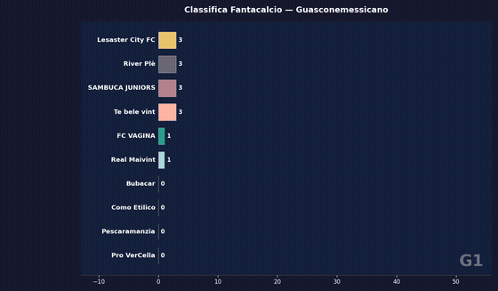
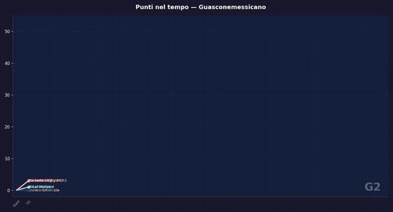

# Fanta Race

A web app that visualizes your Fantacalcio (Italian fantasy football) league standings with animated charts.

Upload the Excel file exported from Fantagazzetta and get two animated charts:

- **Bar Chart Race** — cumulative standings, matchday by matchday, with bars reordering in real time
- **Line Chart** — points accumulated over time, with lines drawing progressively

---

## Demo

| Bar Chart Race | Line Chart |
|----------------|------------|
|  |  |

---

## Requirements

- Python 3.9+
- pip

---

## Installation

```bash
git clone https://github.com/fordummies92/fanta_race.git
cd fanta_race
pip install flask openpyxl requests beautifulsoup4
```

---

## Run

```bash
python3 app.py
```

Open your browser at [http://localhost:5050](http://localhost:5050).

---

## How to use

1. Export your league's calendar from **Fantagazzetta** (`.xlsx` file)
2. Drag and drop the file onto the upload page
3. (Optional) Paste your league's URL to fetch team logos
4. Click **Generate Charts**

In the dashboard:
- Press **▶ Play** to start both animations in sync
- Use **🐢 / 1× / ⚡** to change the playback speed
- Drag the slider below each chart to jump to a specific matchday

---

## Project structure

```
fanta_race/
├── app.py              # Flask backend: Excel parsing, logo fetching, routing
├── fanta_race.py       # Original script: generates GIFs/MP4s with matplotlib
├── templates/
│   ├── index.html      # Upload page
│   └── dashboard.html  # Dashboard with the two Plotly charts
└── README.md
```

---

## Supported Excel format

The file must contain a sheet with rows in the Fantagazzetta format (`Xª Giornata lega`). The sheet can be named anything — the app detects it automatically.

---

## Team logos

If you provide your league's URL, the app tries to fetch team logos from the API or website:

- `https://leghe.fantacalcio.it/league-name/calendario`
- `https://leghe.fantagazzetta.com/league-name/12345`

If logos aren't found (single-page apps don't always expose data in the HTML), the charts still work, falling back to colors automatically assigned to each team.

---

## Tech stack

- **Backend** — Python, Flask
- **Excel parsing** — pandas, openpyxl
- **Charts** — Plotly
- **Logo fetching** — requests, BeautifulSoup
